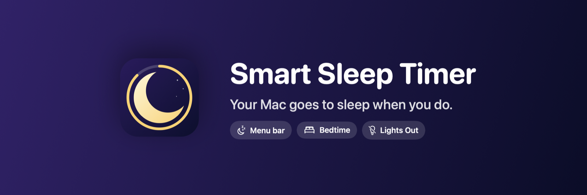
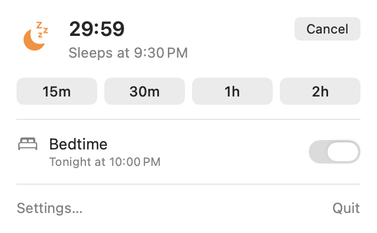
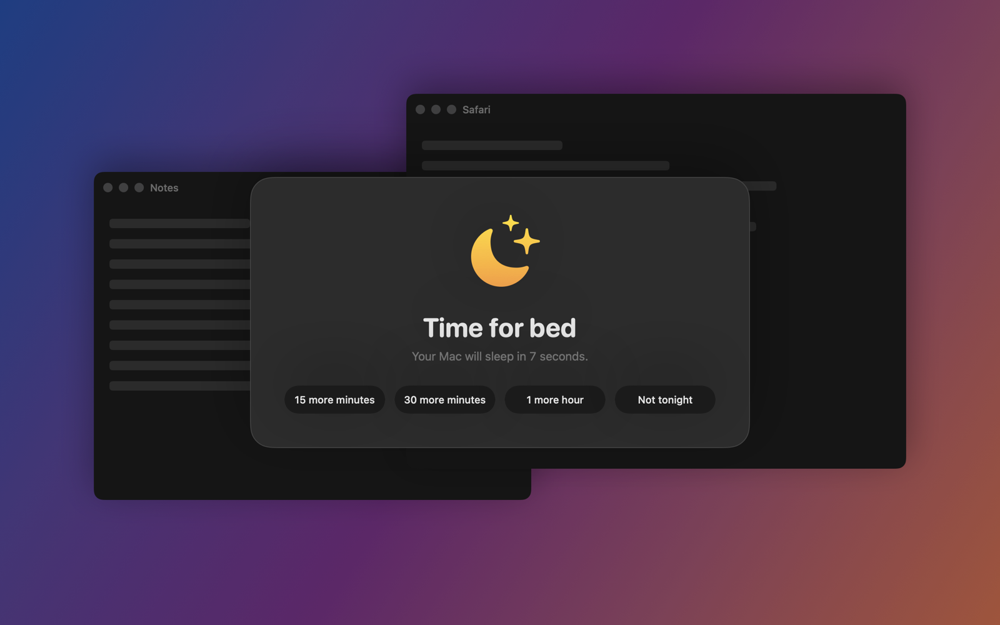
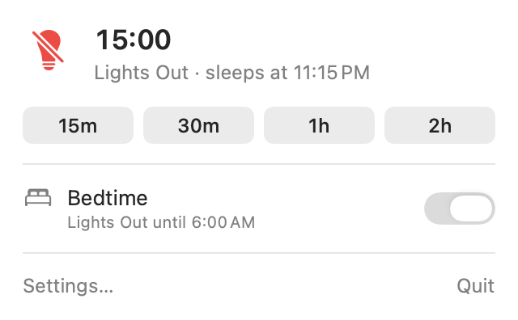
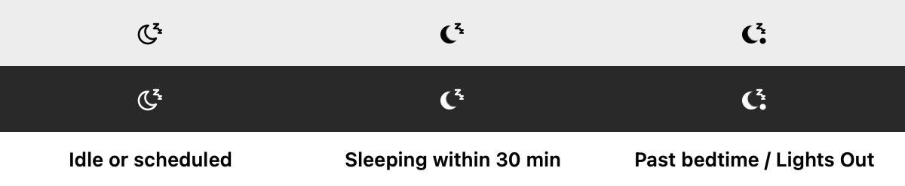
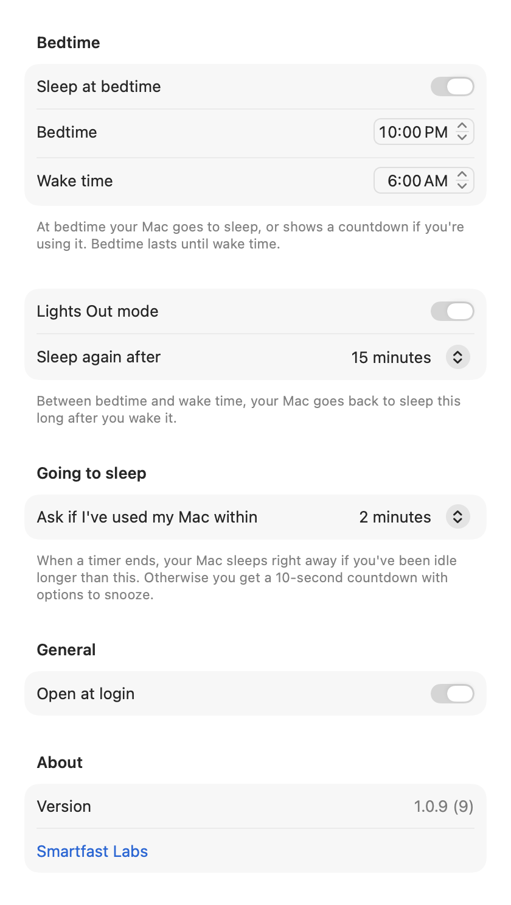

<p align="center">
  
</p>

<p align="center">
  <a href="https://apps.apple.com/us/app/smart-sleep-timer/id6717561931?mt=12"></a>
  
  
  
  <a href="LICENSE"></a>
</p>

**Smart Sleep Timer** is a tiny menu bar app that puts your Mac to sleep when you mean to stop. Set a timer before you start a show. Give yourself a bedtime. Turn on Lights Out and your Mac keeps going back to sleep until morning. If you're still typing when time's up, it asks first.

No accounts. No network. No tracking. It's sandboxed, it runs from the menu bar, and it does one thing.

<p align="center">
  <a href="https://apps.apple.com/us/app/smart-sleep-timer/id6717561931?mt=12"><b>Get it on the Mac App Store →</b></a>
</p>

---

## Quick timers from the menu bar

Click the moon, pick 15 minutes to 2 hours, and forget about it. The popover shows exactly when your Mac will sleep.

<p align="center">
  <picture>
    <source media="(prefers-color-scheme: dark)" srcset="docs/screenshots/popover-dark.png">
    
  </picture>
</p>

## It asks before it acts

If you've touched the keyboard or mouse in the last couple of minutes when a timer ends, your Mac doesn't just vanish under you. A full-screen countdown gives you ten seconds and four choices. Left alone, it sleeps.

<p align="center">
  
</p>

If you've stepped away, there's no countdown at all. Your Mac sleeps silently, which is the whole point.

## Bedtime

Set a bedtime and a wake time. When bedtime arrives, your Mac goes to sleep, or shows the countdown if you're mid-sentence. Bedtime lasts until wake time, so 10 PM to 6 AM is one night, and midnight doesn't confuse it.

## Lights Out

The feature for people who wake the Mac back up at 1 AM "just to check something." Between bedtime and wake time, Lights Out puts the Mac back to sleep a set number of minutes after every wake. Fifteen minutes by default. Snoozing buys you another round. **Not tonight** on the countdown turns it off until morning, and the popover shows a Resume button in case you change your mind.

<p align="center">
  <picture>
    <source media="(prefers-color-scheme: dark)" srcset="docs/screenshots/popover-lightsout-dark.png">
    
  </picture>
</p>

## The icon tells you what's coming

<p align="center">
  
</p>

## Settings

Everything lives in one window. Bedtime and wake time, Lights Out and its interval, how long you have to be idle before the Mac sleeps without asking, and open at login.

<p align="center">
  <picture>
    <source media="(prefers-color-scheme: dark)" srcset="docs/screenshots/settings-dark.png">
    
  </picture>
</p>

## Privacy

Smart Sleep Timer makes no network connections and collects nothing. It reads how long you've been idle from the system, which needs no special permission, and puts the Mac to sleep with the same command the `pmset` tool uses. It runs inside the macOS App Sandbox.

## Requirements

macOS 15 Sequoia or later, Apple silicon or Intel.

---

## Building from source

The app is a plain Xcode project with no dependencies.

```bash
git clone https://github.com/smartfastlabs/smart-sleep-timer.git
cd smart-sleep-timer
open SleepTimer.xcodeproj
```

Press Run. To build and test from the terminal:

```bash
xcodebuild -project SleepTimer.xcodeproj -scheme SleepTimer -destination 'platform=macOS' CODE_SIGNING_ALLOWED=NO test
```

### How it's put together

- `SleepTimer/Models` holds the logic: `SleepScheduler` is the state machine that decides when to sleep, `BedtimeSchedule` is the window math, and `Preferences` persists settings.
- `SleepTimer/Services` talks to the system: idle time, sleeping, and the login item.
- `SleepTimer/Views` is SwiftUI. The countdown overlay is the one piece of AppKit, because it has to float above full-screen apps.
- `SleepTimerTests` drives the scheduler with a fake clock, renders every view to catch wiring mistakes, and generates the screenshots on this page from the real views. Run `Scripts/screenshots.sh` to regenerate them.

## Contributing

Issues and pull requests are welcome. If you're changing behavior, add a scheduler test; they're short and they run in under a second.

## License

[AGPL-3.0](LICENSE). Made by [Smartfast Labs](https://smartfast.com).
